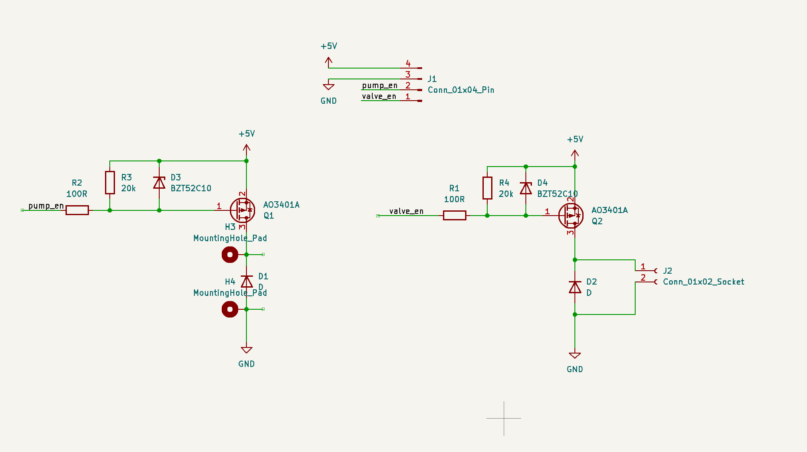
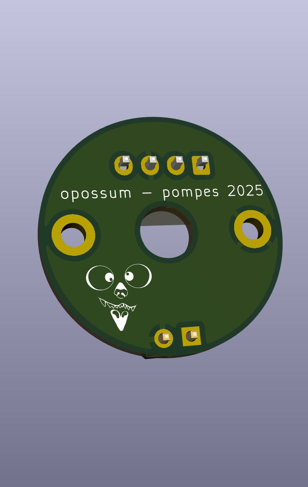
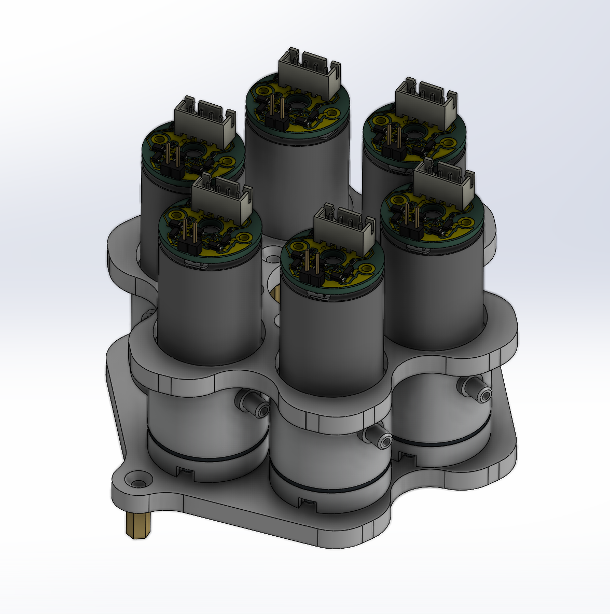

# Carte pompes - opossum 2025

Ce repository à pour objectif la création de cartes éléctroniques pour des pompes 5V pour le système de ventouses du robot de la Coupe de France de robotique 2025.
Les cartes ont été designé avec kicad 8.0.

## Les pompes
Le pompes utilisées sont de ce type :

## Le schéma électrique
Chaque carte sert au contrôle :
- d'une pompe
- d'une éléctrovanne

## L'intégration mécanique
### 1 - Le pcb :
Le pcb est soudable directement sur la pompe:

  
  

### 2 - système de pompes :

Voici un exemple d'intégration dans le robot 2025 :
